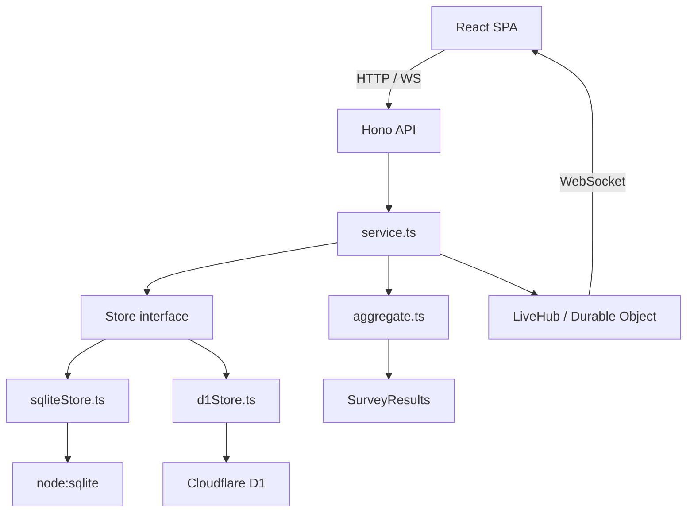

# Surket Documentation

Welcome to the Surket documentation hub. Surket is an all-in-one **event itinerary + live survey platform** built by [Lehro Solutions](https://github.com/LehroSolutions).

---

## Documentation Index

| Document | Description |
|----------|-------------|
| [Architecture](./architecture.md) | System architecture, data model, layer boundaries, and design principles |
| [How It Works](./how-it-works.md) | Technical deep dive into every subsystem (store, analytics, live tally, SPA) |
| [User Guide](./user-guide.md) | Step-by-step guide for operators and attendees |
| [API Reference](./api-reference.md) | Complete HTTP API contract with request/response shapes |
| [Deployment Guide](./deployment-guide.md) | Deploy to Node, Vercel, or Cloudflare Workers |
| [ADR — Decision Records](./adr/) | Architecture Decision Records explaining key technical choices |
| [Roadmap](./roadmap.md) | Planned features and future direction |
| [Interactive Diagrams](./diagrams.html) | Browser-rendered Mermaid architecture diagrams |

---

## Quick Links

- **Repository:** <https://github.com/LehroSolutions/surket>
- **Stack:** Node.js 22.5+ · Hono · React 19 · Vite 8 · Cloudflare D1 · GSAP
- **Runtime:** `node:sqlite` (zero native modules)
- **Package Manager:** pnpm 9+ workspace

---

## Getting Started (30 seconds)

```bash
git clone https://github.com/LehroSolutions/surket.git
cd surket
corepack enable
pnpm install

# Terminal 1 — API server on :8787
pnpm --filter @surket/server dev

# Terminal 2 — SPA on :5173 (proxies /api → server)
pnpm --filter @surket/web dev
```

Open <http://localhost:5173>. Demo data is seeded automatically on first run.

---

## Architecture at a Glance



See [architecture.md](./architecture.md) for the full breakdown.
