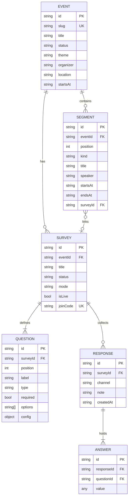
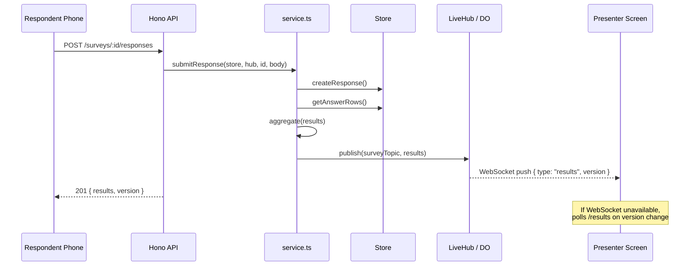

# Architecture

This document describes Surket's system architecture, data model, layer boundaries, and the design principles that govern every extension.

---

## 1. Design Principles

| # | Principle | Rationale |
|---|-----------|-----------|
| 1 | **One Store contract, many drivers** | All data access goes through the `Store` interface (`server/src/types.ts`). `sqliteStore.ts` and `d1Store.ts` implement it identically. Swapping storage never touches business logic. |
| 2 | **Pure analytics** | `aggregate.ts` has zero I/O. Given a survey + answer rows it returns `SurveyResults` — deterministic, trivially testable, and identical across runtimes. |
| 3 | **One composition layer** | `service.ts` is the only place that wires Store + aggregate + live hub. Both Node and Cloudflare call the same `getSurveyResults` / `submitResponse`. |
| 4 | **Framework at the edges only** | Hono routing lives in `app.ts`. Entry points (`index.ts`, `worker.ts`, `api/index.ts`) just construct dependencies and hand them to `createApp`. |
| 5 | **No native modules** | Storage uses Node's built-in `node:sqlite` (unflagged from 23.4+). No C/C++ toolchain, no Python, no build-tools required at any stage. |
| 6 | **Client-side preferences** | Theme, density, color mode, and motion preferences live in `localStorage`. Zero backend writes for UI state — works identically on Vercel, Cloudflare, and self-hosted. |

---

## 2. System Layers

```
┌─────────────────────────────────────────────────────────────┐
│  Browser (React 19 SPA)                                     │
│  Vite 8 · GSAP · Motion · custom router                     │
│  Pages: Dashboard, EventWorkspace, SurveyBuilder,           │
│         LivePresent, Respond, PublicItinerary, Settings     │
└────────────────────────────┬────────────────────────────────┘
                             │ HTTP (REST + JSON)
                             │ WebSocket (live tally)
┌────────────────────────────▼────────────────────────────────┐
│  Hono HTTP Layer (app.ts)                                   │
│  Security: CORS, rate-limit, body-size, OWASP headers       │
│  Auth: admin-token gated mutations, open reads              │
└────────────────────────────┬────────────────────────────────┘
                             │
┌────────────────────────────▼────────────────────────────────┐
│  Service Layer (service.ts)                                 │
│  getSurveyResults()  submitResponse()                       │
│  Wires Store + aggregate + LiveHub broadcast                │
└──────────┬─────────────────┬────────────────────────────────┘
           │                 │
┌──────────▼──────┐ ┌───────▼──────────────────┐
│ Store interface │ │ aggregate.ts (pure)       │
│ (types.ts)      │ │ tally · NPS · sentiment   │
│                 │ │ keywords · daily timeline  │
└───┬─────────┬───┘ └──────────────────────────┘
    │         │
┌───▼──┐  ┌──▼───────┐
│Node  │  │Cloudflare│
│sqlite│  │D1        │
│Store │  │Store     │
└──────┘  └──────────┘
```

---

## 3. Domain Model

All types live in `server/src/types.ts` and are mirrored in `web/src/types.ts`.



### Entity Summary

| Entity | Description |
|--------|-------------|
| **Event** | Top-level container. `status: draft \| live \| archived`, a `theme`, an `organizer`, a URL `slug`. |
| **Segment** | One itinerary entry. `kind: keynote \| session \| workshop \| panel \| break \| networking \| survey`. Ordered by `position`. May link a `surveyId`. |
| **Survey** | A set of questions. `status: draft \| live \| paused \| closed`, `mode: standard \| live`, an `isLive` toggle, and a short `joinCode`. |
| **Question** | `type: rating \| single \| multi \| number \| text \| nps \| scale \| date`. Extensible `config` for bounds and labels. |
| **Response** | A respondent's submission. Holds `channel` (web, mobile, etc.) and an optional `note`. |
| **Answer** | Per-question value inside a response. `AnswerValue = string \| number \| string[]`. |
| **SurveyResults** | Computed analytics: tallies, `averageRating`, `npsScore`, `sentiment`, `keywords`, `daily` timeline, monotonic `version`. |

---

## 4. Live Tally Architecture

The live tally system enables real-time result streaming from respondents to a big-screen presenter view.



### Transport Selection

`GET /api/config` returns `{ liveTransport: "websocket" | "polling" }`.

| Host | Transport | Mechanism |
|------|-----------|-----------|
| Node (local) | WebSocket | In-process `LiveHub` pub/sub (`live.ts`) |
| Cloudflare | WebSocket | Per-survey `LiveTallyRoom` Durable Object |
| Vercel | Polling | Serverless functions can't hold WS connections |

### Why `version` exists

`SurveyResults.version` is a monotonic counter incremented on every recorded response. It is the single source of truth for "has anything changed?" — the polling fallback in `useLiveTally.ts` only re-renders when `version` increases, so the UI never flickers or double-counts.

---

## 5. Security Model

The Hono app applies a layered security stack:

| Layer | Implementation | Purpose |
|-------|---------------|---------|
| Request logging | `requestLogger()` | Audit trail for all API calls |
| Security headers | `securityHeaders()` | OWASP-aligned: X-Frame, CSP, etc. |
| Hardened CORS | `hardenedCors()` | Environment-aware origin policy |
| Body size limit | `bodySizeLimit(100KB)` | Prevent payload abuse |
| Rate limiting | `rateLimit(120/min)` | Per-IP throttle on `/api/*` |
| Admin token | Middleware guard | Write routes require `x-admin-token` when `ADMIN_TOKEN` is set |

**Public routes** (no token required): reading events/surveys, looking up join codes, and **submitting responses** — so attendees can answer without credentials.

---

## 6. Frontend Architecture

```
web/src/
├── main.tsx              # Entry: SettingsProvider → RouterProvider → App
├── App.tsx               # Route table (shell vs full-screen)
├── router.tsx            # Tiny History-API router (no react-router)
├── types.ts              # Frontend type mirror of server types
├── styles.css            # CSS custom properties + component styles
├── api.ts                # Typed HTTP client for /api
├── components/
│   ├── Layout.tsx        # App shell: sidebar + topbar + theme toggle
│   ├── ui.tsx            # Button, Card, Badge, Modal, Toast, etc.
│   ├── icons.tsx         # Inline SVG icon system (zero network requests)
│   ├── QuestionInput.tsx # Question type renderers
│   ├── Share.tsx         # QR + URL sharing
│   ├── charts.tsx        # Bar, spark, donut chart components
│   └── reactbits/        # Animated UI components (ColorBends, SplitText, etc.)
├── pages/
│   ├── Dashboard.tsx     # Event list + stats
│   ├── EventWorkspace.tsx # Event detail: itinerary, surveys, analytics
│   ├── SurveyBuilder.tsx # Question editor + ordering
│   ├── LivePresent.tsx   # Big-screen live tally view
│   ├── Respond.tsx       # Attendee survey form
│   ├── PublicItinerary.tsx # Public event timeline
│   ├── Join.tsx          # Join code entry
│   ├── Templates.tsx     # Template gallery
│   └── Settings.tsx      # Operator preferences
├── hooks/
│   └── useLiveTally.ts   # WebSocket + polling fallback hook
└── lib/
    ├── settings.tsx       # Client-side preferences + theme system
    ├── motion.ts          # GSAP reveal animations
    ├── export.ts          # CSV/JSON export utilities
    ├── qrcode.ts          # Pure-JS QR code generator
    └── timezone.ts        # Timezone-aware date formatting
```

### Theme System

The color mode system supports **dark**, **light**, and **system** (follows OS preference):

- **CSS variables** defined on `:root` (dark) and `[data-color-mode="light"]` (light)
- **5 accent themes**: Aurora, Ember, Forest, Violet, Rose — each with light-mode contrast overrides
- **Persistence**: `localStorage` via `surket.settings` key
- **Quick toggle**: sun/moon button in the topbar
- **Full controls**: Settings page with Dark/Light/System segmented control

---

## 7. Monorepo Structure

```
surket/
├── web/                # React + Vite SPA
├── server/             # Hono API + storage + analytics
│   ├── src/
│   │   ├── types.ts       # Domain types + Store contract
│   │   ├── schema.ts      # SQL schema (portable)
│   │   ├── util.ts        # IDs, slugs, join codes, helpers
│   │   ├── sqliteStore.ts # Node driver (node:sqlite)
│   │   ├── d1Store.ts     # Cloudflare D1 driver
│   │   ├── aggregate.ts   # Pure analytics engine
│   │   ├── templates.ts   # Event + survey blueprints
│   │   ├── seed.ts        # Demo data seeder
│   │   ├── live.ts        # In-memory LiveHub
│   │   ├── service.ts     # Composition layer
│   │   ├── app.ts         # Hono routes
│   │   ├── security.ts    # Security middleware stack
│   │   ├── index.ts       # Node entry
│   │   └── worker.ts      # Cloudflare entry
│   ├── migrations/        # D1 migration SQL
│   └── wrangler.toml      # Cloudflare config
├── api/                # Vercel serverless entry
├── scripts/            # verify.ts — data-layer test harness
├── docs/               # This documentation
├── vercel.json         # Vercel build + routing
└── pnpm-workspace.yaml # Workspace config
```
